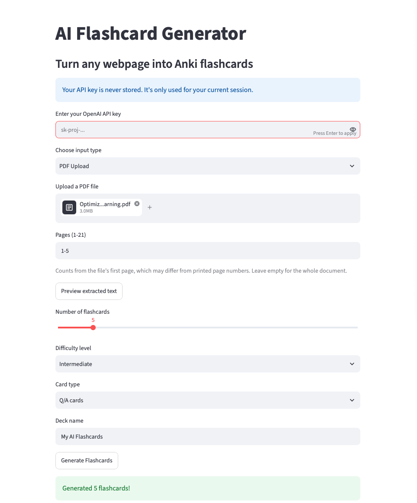
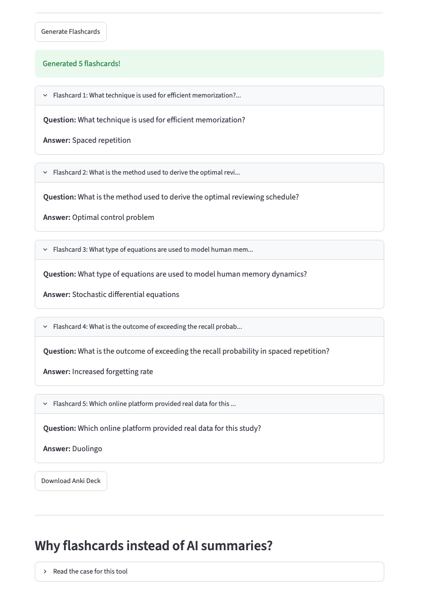
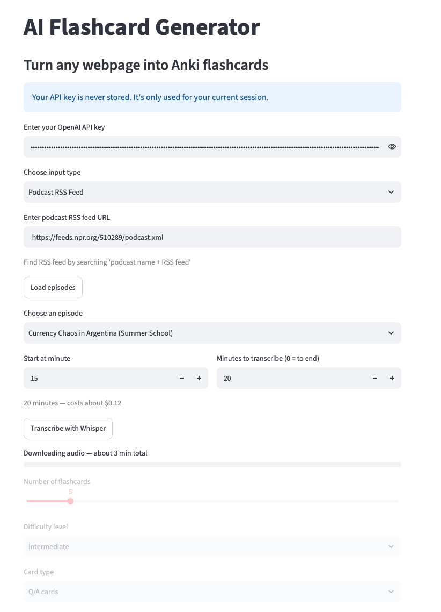

# AI Flashcard Generator

Sovellus, joka muuntaa artikkelit, PDF-dokumentit ja podcastit
Anki-muistikorteiksi. Python, Streamlit, OpenAI API.

Projekti alkoi Building AI -kurssin kurssiprojektina ja työkaluna omaan
käyttööni. Matkan varrella se laajeni kysymykseksi siitä, milloin
kielimalliin voi luottaa ja milloin ei.

[Koodi GitHubissa](https://github.com/frostpine3004/anki-generator) ·
[Tekninen dokumentaatio (englanniksi)](https://github.com/frostpine3004/anki-generator/blob/main/DESIGN.md)

---

## Sisällys

1. [Lähtökohta](#lähtökohta)
2. [Mitä työkalu tekee](#mitä-työkalu-tekee)
3. [Myyntitekstin toimitus](#myyntitekstin-toimitus)
4. [Rajaukset: mitä jätin pois ja miksi](#rajaukset-mitä-jätin-pois-ja-miksi)
5. [Automatisoinnin raja oppimisessa](#automatisoinnin-raja-oppimisessa)
6. [Kielimallin ohjaaminen](#kielimallin-ohjaaminen)
7. [Lähteen laatu ratkaisee](#lähteen-laatu-ratkaisee)
8. [Kielelliset valinnat](#kielelliset-valinnat)
9. [Lopuksi](#lopuksi)

---

## Lähtökohta

Anki on ilmainen muistikorttisovellus, joka tehostaa oppimista. Sitä käytetään
tilanteissa, joissa oppimateriaali sisältää paljon täsmällistä muistettavaa,
kuten käsitteitä, termistöä ja määritelmiä.

Menetelmän teho perustuu kahteen tutkittuun ilmiöön:

- **Testausvaikutus.** Itsensä testaaminen jättää vahvemman muistijäljen kuin
  materiaalin uudelleen lukeminen (Karpicke & Roediger 2008).
- **Kertauksen jaksottaminen.** Usealle päivälle hajautettu kertaus tuottaa
  paremman tuloksen kuin yksi pitkä opiskelukerta (Cepeda ym. 2006).

Anki-sovelluksessa molemmat ilmiöt yhdistyvät: kysymyskortti testaa osaamisen,
ja ajastin ajoittaa kertauksen automaattisesti niin, että kortti tulee
käyttäjän eteen juuri ennen kuin asia ehtii unohtua. Ankin nykyinen algoritmi
FSRS mallintaa unohtamista ja säätää välit käyttäjän oman vastaushistorian
mukaan, joten sadan kortin pakasta tulee päivittäin eteen vain ne, jotka ovat
unohtumassa.

Tämä erottaa Ankin muista muistikorttityökaluista. Esimerkiksi Googlen
NotebookLM osaa generoida kortteja ja näyttää ne selattavassa muodossa, mutta
siinä ei ole ajastinta. Sama koskee Notioniin tehtyjä muistikorttipohjia. Ne
ovat vapaasti kopioitavissa ja muokattavissa, mutta laskevat seuraavan
kertauspäivän kiinteällä kaavalla eivätkä mukaudu käyttäjän oppimistahtiin.

Ankissa oppimismetodin työläin osa, eli korttien kirjoittaminen, jää
käyttäjälle, ja moni jättää menetelmän sen takia. Ratkaisuja on kehitetty
useita. Esimerkiksi Ankify, AnkiDecks ja AnkiBrain automatisoivat korttien
generointivaiheen.

Halusin oppia tekoälyrajapintojen käyttöä, Python-ohjelmointia ja
automaattista tiedonkeruuta verkosta rakentamalla jotain, jota itse
käyttäisin. Markkinoinnin puolelta halusin harjoitella teknisen tuotteen
positiointia ja myyntiviestintää sekä oppia hallitsemaan tekoälyn tuottamaa
tekstiä osana sovellusta.

Projektin aikana rajasin sovelluksen niihin ominaisuuksiin, joita en löytänyt
kilpailijoilta: podcast-tuki, kustannusten näkyvyys ja niiden rajaaminen
etukäteen sekä avoin toteutus.

Työkalu automatisoi korttien kirjoittamisen ja tuottaa ne .apkg-tiedostona,
joka tuodaan käyttäjän omaan korttikokoelmaan. Muu jää Ankin hoidettavaksi:
aikataulutus, asetukset ja opiskelurytmi pysyvät käyttäjällä.

---

## Mitä työkalu tekee

Käyttäjä antaa lähteen, valitsee korttityypin ja määrän, ja lataa valmiin
korttipakan.

- **Työkalu tukee viittä lähdetyyppiä:** verkkosivuja, YouTube-transkripteja,
  PDF-dokumentteja, podcastien RSS-syötteitä ja vapaata tekstiä.
- **Korttityyppejä on kaksi:** kysymys ja vastaus -kortti sekä aukkotehtävä,
  jossa käsite on piilotettu lauseesta.
  

### Erottautuminen

Anki-yhteensopivia tekoälytyökaluja on useita, ja moni niistä tuottaa saman
tiedostomuodon. Tiedostovienti ei siis yksin riitä erottautumiseen. Vertailin
tarjolla olevia työkaluja ja keskityin neljään osa-alueeseen, joilla työkalu
voi tuoda jotakin lisää: lähdetyyppeihin, kustannusten ennakoitavuuteen,
avoimeen toteutukseen ja siihen, ettei sisältöä säilytetä.

- **Podcastien käsittely on toteutettu kahdella tavalla.** Osa podcasteista
  julkaisee transkriptin RSS-syötteessään, jolloin se haetaan suoraan
  lähteestä. Jos transkriptia ei ole, jakson äänitiedosto litteroidaan
  Whisperillä, joka on OpenAI:n puheentunnistusmalli. Työkalut, joihin
  tutustuin, käsittelevät dokumentteja ja videoita, mutta eivät ääntä.
- **Kustannusarvio ennen ajoa.** Käyttäjä tuo oman rajapinta-avaimensa ja
  maksaa vain käytöstään. Korttien generointi maksaa sentin murto-osia,
  litterointi noin kuusi senttiä kymmeneltä minuutilta. Hinta näytetään ennen
  ajoa, ja käyttäjä voi rajata litteroitavan osuuden. Osa kilpailijoista perii
  kuukausimaksun tai kertamaksun.
  
  
  
- **Avoin lähdekoodi.** Koko toteutus on tarkistettavissa.
  
- **Ei käyttäjätiliä eikä tallennettua sisältöä.** Sisältö kulkee OpenAI:n
  rajapinnan kautta, kuten kaikissa vastaavissa työkaluissa, mutta sovellus
  itse ei tallenna siitä mitään. Ero esimerkiksi NotebookLM:ään on
  rakenteellinen: muistikirjamainen toteutus säilyttää lähteet käyttäjän
  tilillä, kun taas tämä työkalu käsittelee lähteen kerran ja unohtaa sen.

### Muuta toteutuksesta

- **Laadunvarmistus kahdessa vaiheessa.** Malli tuottaa kaksinkertaisen määrän
  kortteja, ja toinen kutsu hylkää niistä heikot, esimerkiksi ne, joiden
  vastaus on luettavissa kysymyksestä. Käyttäjä saa pyytämänsä määrän, mutta ne
  on valittu suuremmasta joukosta.

---

## Myyntitekstin toimitus

Sovelluksessa on lyhyt englanninkielinen esittelyteksti, joka avautuu
käyttöliittymän alalaidasta. Se on ainoa markkinointimateriaali, jonka
käyttäjä näkee: työkalulla ei ole laskeutumissivua eikä muuta esittelyä.
Tekstin tehtävä on vastata kysymykseen siitä, miksi käyttäisit juuri tätä
työkalua etkä jotain toista.

Lähdin liikkeelle käyttäjän tilanteesta. Sivustolle päätyy joku, joka tuntee
Ankin ja tietää jo, miksi muistikortit toimivat. Hän ei tarvitse perustelua
menetelmälle vaan vastauksen siihen, miksi valita juuri tämä työkalu.

Siitä seurasi neljä ratkaisua.

**Jokainen erottautumistekijä käännettiin hyötyargumenteiksi.** Esimerkiksi
avoin lähdekoodi ja oman rajapinta-avaimen käyttö tarkoittavat käyttäjälle
sitä, että työkalun hinnaksi muodostuu muutama sentti eikä kuukausimaksu.
Esille nostettiin myös hyöty kustannusten hallinnasta: käyttäjä näkee
materiaalin käsittelyn hinnan ennen kuin kulu syntyy. Se, ettei sisältöä
tallenneta, tarkoittaa sitä, ettei käyttäjän tarvitse luoda tiliä eikä siirtää
opiskelumateriaalejaan yhden palveluntarjoajan järjestelmään.

**Hinta nostettiin tekstin alkuun.** Sovelluksen pääkäyttäjäryhmä on
opiskelijat, ja osa kilpailijoista perii kuukausimaksun tai kertamaksun.
Käyttökustannus on siis konkreettinen ero muihin työkaluihin ja ansaitsee
ensimmäisen paikan viestissä. Viittaukset oppimistutkimukseen siirtyivät
tekstin loppuun, koska sovellukseen päätynyt lukija on todennäköisesti jo
valinnut menetelmän.

**Väitteet tarkistettiin ja osa poistettiin.** Tekstin ensimmäisessä versiossa
oli prosenttiluku siitä, kuinka paljon opitusta unohtuu. Luku on verkossa
laajasti käytetty, mutta alkuperäistä lähdettä sille ei löytynyt. Samasta
syystä poistui viittaus Hermann Ebbinghausin unohtamiskäyrään: sitä voidaan
pitää oppimisen tunnetuimpana yksittäisenä tutkimustuloksena, mutta se on
peräisin 1880-luvulta ja perustuu yhteen koehenkilöön, joka opetteli
merkityksettömiä tavuja. Tilalle valitsin kaksi uudempaa tutkimusta, jotka
liittyvät suoraan siihen oppimisen menetelmään, jota työkalu tukee.

**Heikoin argumentti jätettiin mainitsematta.** Sovelluksessa voi valita
korttien vaikeustason. Ominaisuus jäi käyttöön, mutta poistin sen
myyntitekstistä, koska vaikeustaso riippuu siitä, mitä lukija jo osaa, eikä
valinta siksi tuota luotettavaa eroa korttien välille. Ominaisuuden
mainitseminen olisi myös vienyt tilaa niiltä väitteiltä, jotka oikeasti
erottavat työkalun muista.

Lopullinen teksti on sivun lopussa liitteenä.

---

## Rajaukset: mitä jätin pois ja miksi

**Pelillistäminen.** Pelillisyyttä lisäävät elementit olisivat vaatineet
tietokannan ja rikkoneet periaatteen siitä, ettei mitään tallenneta. Se, ettei
tietoja kerätä, erottaa työkalun kaupallisista alustoista, jotka tallentavat
käyttäjädatan pilveen. Pelillistäminen olisi myös mitannut väärää asiaa:
korttipakkojen määrä ei kerro oppimisesta mitään.

**Blogi tuoteominaisuutena.** Oppimista käsittelevä blogi olisi kilpaillut
tuhansien vastaavien sisältösivustojen kanssa ilman erottuvaa näkökulmaa.
Sisältömarkkinointi ilman kulmaa on työtä, joka ei tuota mitään.

**YouTuben automaattinen haku.** Automatisoitu pääsy YouTube-sisältöihin
rikkoisi palvelun käyttöehtoja. Ratkaisuna käyttäjä liittää transkriptin itse,
jolloin päätös haettavasta sisällöstä ja vastuu siitä on käyttäjällä.

**Automaattinen kielioppikorjaus.** Toteutettiin kolmella eri tavalla ja
lopulta poistettiin. Perustelu on osiossa Kielimallin ohjaaminen.

---

## Automatisoinnin raja oppimisessa

Kielimalli voi auttaa opiskelijaa monella tavalla. Se tiivistää
luentomateriaalin, vastaa kysymyksiin ja selittää käsitteet auki niin monta
kertaa kuin käyttäjä haluaa. Se tekee kognitiivisesta ulkoistamisesta
helpompaa kuin koskaan. Kysymys kuuluukin, mikä osa työstä kannattaa
ulkoistaa ja mikä ei.

Kognitiivisen ulkoistamisen vaikutuksista on toistaiseksi vähän tutkimusta.
Farhat (2026) haastatteli 45:tä päivittäin ChatGPT:tä käyttävää nuorta
aikuista, ja aineistosta erottui kaksi vastakkaista käyttötapaa. Osa kuvasi
ulkoistaneensa muistinsa lähes kokonaan työkalulle, kun taas toinen ryhmä
käytti työkalua rutiinitehtäviin ja vapautti näin ajattelukapasiteettia
vaativampaan työhön. Otos oli pieni ja koski yhtä ikäryhmää saman maan
sisällä, joten yleistyksiä siitä ei voi tehdä.

Jälkimmäinen on se käyttötapa, johon tekemäni työkalu on suunniteltu. Korttien
kirjoittaminen on suurelta osin mekaanista työtä, ja sen automatisointi
vapauttaa aikaa aineiston aktiiviseen kertaamiseen.

Kertaamisen kohteen valinta ei ole yhdentekevä. Kognitiivisen
kuormitusteorian mukaan työmuistiin mahtuu kerrallaan vain muutama asia. Jos
peruskäsitteet vaativat yhä aktiivista muistelua, kapasiteetti kuluu niihin
eikä kokonaisuuden hahmottamiseen jää tilaa. Kun perusteet ovat
automatisoituneet, huomiota vapautuu siihen, miten osa-alueet liittyvät
toisiinsa. Koska uusi tieto kiinnittyy siihen, mitä opiskelija jo ennestään
osaa, kiinnityskohtien määrä ratkaisee, kuinka tehokkaasti oppiminen etenee.

Syvä ymmärrys vaatii tiedon jäsentämistä omin sanoin, käsitteiden vertailua ja
tiedon soveltamista käytäntöön. Soveltaminen ei onnistu, jos peruskäsitteet
eivät ole hallinnassa. Anki-kortit ovat siis oppimisen polun alku, eivät sen
päätepiste.

Työkalun jatkokehityksessä ratkaisuna voisi olla tila, jossa kysymykset ovat
keskustelevia ja vastaus koostuu kolmesta pääkohdasta yhden määritelmän
sijaan. Se harjoittaisi terminologian sujuvuutta, joka on edellytys sille,
että aiheesta pystyy keskustelemaan täsmällisesti. Itse keskustelutaitoa se ei
kuitenkaan korvaisi.

---

## Kielimallin ohjaaminen

Projektin suurin oivallus oli, että työn vaikein osa ei ollut ohjelmoinnissa.
Koodi hakee sisällön, kutsuu rajapintaa, jäsentää vastauksen ja rakentaa
tiedoston. Se osuus valmistui nopeasti ja pysyi vakaana.

Vaikeinta oli saada malli tuottamaan johdonmukaista laatua. Malli saa
ohjeekseen joukon kirjoitettuja sääntöjä eli prompteja siitä, millainen on
hyvä kortti. Ongelma on, ettei kielimalli ole deterministinen: sama ohje
tuottaa eri tuloksen joka ajolla, ja sääntö, joka toimii kolmella kortilla, ei
välttämättä toimi neljännellä. Perinteinen virheenetsintä ei silloin päde,
koska yhtä oikeaa vastausta ei ole olemassa.

Työtapa muistuttaa koesuunnittelua enemmän kuin tavanomaista
ohjelmistokehitystä. Molemmissa tavoissa iteroidaan, mutta tavallisessa
koodissa sama syöte tuottaa saman tuloksen, joten yksi ajo riittää kertomaan,
toimiiko korjaus. Kielimallin kanssa se ei yksin riitä: mittari on valittava
etukäteen, yhtä asiaa muutetaan kerrallaan ja testaus on toistettava tarpeeksi
monta kertaa, jotta satunnaisvaihtelu erottuu todellisesta muutoksesta.

### Ongelma ei aina ole siellä missä se näyttää olevan

Aukkokorttien laatu ei parantunut viidellä peräkkäisellä promptausversiolla.
Kun korjasin yhden virhetyypin, toinen syntyi tilalle.

Syy oli tehtävien järjestyksessä. Malli kirjoitti ensin lauseen ja valitsi
vasta sitten piilotettavan käsitteen. Aukko päätyi siihen, mikä sattui olemaan
saatavilla: rakennesanoihin, käsitteiden osiin tai sanoihin, jotka pystyi
päättelemään lauseen kieliopista. Kortti näytti oikealta mutta ei testannut
mitään olennaista.

Kiellot promptissa eivät auttaneet, koska ongelma syntyi jo ennen valintaa.
Kun lause oli kirjoitettu, aukko oli valittava sen sanoista. Jos yhtään
kunnollista käsitettä ei ollut, mikään sääntö ei voinut pelastaa korttia.

Ratkaisuna toimi vaiheiden järjestyksen vaihtaminen. Ensimmäinen vaihe poimii
lähteestä avainkäsitteet listaksi, toinen etsii jokaiselle käsitteelle lauseen
ja piilottaa käsitteen. Aukko on päätetty ennen kuin lause valitaan. Sama
kielto yleissanoista toimii tällä kertaa, koska se kohdistuu käsitteiden
poimintaan eikä valmiiseen lauseeseen.

### Negatiivinen tulos on tulos

Suomenkielisessä aineistossa korostuu se, että aukkokortin piilotetun sanan on
oltava lauseen vaatimassa sijamuodossa. Rakensin korjausvaiheen, joka
tarkistaisi tämän automaattisesti.

Tarkistus epäonnistui kolmella eri toteutuksella. Ensimmäinen poisti
aukkomerkin kokonaan. Toinen lisäsi vastauksen aukon viereen. Kolmas toteutus
säilytti lauseen ehjänä mutta vaihtoi oikean taivutusmuodon vääräksi kahdessa
tapauksessa kolmesta.

Päädyin lopulta poistamaan ominaisuuden työkalusta ja dokumentoin havainnon.
Ominaisuus, joka korjaa vähemmän kuin rikkoo, on huonompi kuin puuttuva
ominaisuus. Seuraava askel voisi olla korttien muokkaus ennen vientiä, jolloin
käyttäjä korjaa virheelliset taivutukset itse: malli ei havainnut virheitä
luotettavasti, mutta käyttäjä näkee ne yhdellä silmäyksellä.

Ratkaisua on kokeiltu vain gpt-4o-minillä, joka on rajapinnan edullisin malli.
On mahdollista, että suurempi malli hahmottaisi lauseen rakenteen paremmin,
mutta se on oletus, jota en ole vielä testannut. Kokeilu maksaisi noin
viisitoistakertaisen hinnan ajoa kohden, mikä on ristiriidassa työkalun
keskeisen periaatteen kanssa. Kysymys jää siis auki. Suomen kielen morfologian
korjaus on englantiin verrattuna vaativampi tehtävä, ja mallien osaaminen
vaihtelee kielten välillä. Sen selvittäminen, mikä osa ongelmasta johtuu
mallin koosta ja mikä tehtävän rakenteesta, vaatisi oman testinsä.

### Hylkäysprosentti mittarina

Korttien generointi ei tuottanut aluksi lainkaan tuloksia. Kun lisäsin
käyttöliittymään luvun, joka kertoo, montako korttia tarkistusvaihe hylkäsi,
ongelma rajautui välittömästi. Hylkäysluku oli kymmenen kymmenestä: kortteja
syntyi, mutta tarkistus hylkäsi ne kaikki.

Sovelluksen tarkistuskriteeri oli ohjattu hylkäämään sellainen kortti, jossa
vastauksen käsite esiintyi kysymyksessä. Aukkokortissa kriteeri on
välttämätön, sillä lauseessa näkyvä piilotettu ja käyttäjältä testattava sana
tekee kortista hyödyttömän. Kysymys ja vastaus -kortissa sama sana sen sijaan
esiintyy luonnollisesti molemmissa: "Inflaatio tarkoittaa rahan ostovoiman
heikkenemistä" on oikea vastaus kysymykseen "Mitä inflaatiolla tarkoitetaan?",
mutta tarkistus hylkäsi sen.

Kriteeri oli laadittu aukkokortteja varten, mutta sitä sovellettiin myös
korttityyppiin, jolla on päinvastainen vaatimus. Korjaus oli välittää
tarkistukselle tieto korttityypistä, jolloin kummallakin tyypillä on omat
kriteerinsä.

Ilman mittaria vian paikantaminen olisi vaatinut huomattavasti enemmän työtä.

---

## Lähteen laatu ratkaisee

Kun kortit olivat huonoja, ensimmäinen oletukseni oli, että vika on
promptauksessa. Testasin samaa koodia viidellä erityyppisellä lähteellä.
Valitsin lähteet rakenteen perusteella: tavoitteena oli nähdä, miten koodi
käyttäytyy tiiviin asiatekstin, viittausrikkaan tekstin ja puhutun kielen
kanssa.

| Lähde | Tulos |
| --- | --- |
| Wikipedia-artikkeli | Hyvä. Jokainen lause informatiivinen |
| Opinnäytetyön teoriaosuus | Hyvä. Käsitteet määritelty täsmällisesti |
| Opinnäytetyön kirjallisuuskatsaus | Heikko. Vain viittauksia, ei sisältöä |
| Toimitettu tiedepodcast | Hyvä. Tiivis asiasisältö |
| Haastattelupodcastin alku | Heikko. Esittelyjä, ei käsitteitä |

Koodi pysyi kaikkien lähteiden osalta samana. Erot lähteiden välillä
osoittautuivat kuitenkin suuremmiksi kuin mitä muutos promptauksessa sai
aikaan.

Havainto muutti työtapaani. Kun kortit olivat huonoja, aloin kiinnittää
enemmän huomiota siihen, sisältääkö lähde tarpeeksi sitä materiaalia, jota
siitä yritetään poimia.

Sama koskee testiaineiston valintaa. Testilähde, joka ei edusta tyypillistä
käyttötapausta, ohjaa kehitystä väärään suuntaan. Poikkeuksellisen lähteen
perusteella tehty korjaus voi heikentää tulosta kaikilla muilla lähteillä, ja
samalla todelliset ongelmat jäävät havaitsematta. Testiaineiston tulee edustaa
sitä käyttötapausta, jota mitataan.

---

## Kielelliset valinnat

### Lähteen kieli

Kortit kirjoitetaan sillä kielellä, jolla lähde on alun perin kirjoitettu.
Tämä osoittautui vaikeammaksi kuin odotin: malli saattoi kääntää
englanninkielisen lähteen suomeksi tai muuttaa suomenkielisen lauseen aukon,
eli testattavan käsitteen, englanninkieliseksi termiksi.

Sääntö vaati kaksi promptimuotoilua. Ensimmäinen versio oli neutraali ohje:
kirjoita kortit lähteen kielellä. Se ei toiminut käytännössä. Toimivaksi
versioksi osoittautui kielto, johon on liitetty konkreettinen esimerkki.
Kielto promptissa toimii paremmin kuin ohje, koska se rajaa vaihtoehtoja, ja
esimerkki toimii paremmin kuin abstrakti sääntö, koska se näyttää, mitä sääntö
tarkoittaa käytännössä.

### Puhutun ja kirjoitetun kielen ero

Podcasteissa käytettävä puhuttu kieli ei siirry muistikortiksi sellaisenaan.
Litteroinnissa lause voi olla kieliopillisesti täydellinen mutta silti
riippuvainen kontekstista, eli siitä mitä lauseen asiayhteydessä sanottiin
esimerkiksi ennen käsitteen määrittelyä tai sen jälkeen. Aukkokorttina
tällainen lause ei toimi, koska kortin on toimittava myös yksin ja irrallaan
alkuperäisestä yhteydestään.

Ratkaisin ongelman säännöllä, joka antaa mallille kriteerin kiellettyjen
sanojen listan sijaan: jos lukija ei ymmärtäisi lausetta kuulematta jaksoa,
sitä ei käytetä kortissa. Sanalistat ovat aina epätäydellisiä, mutta kriteeriä
voi soveltaa tapauskohtaisesti.

### Määritelmä vastaan käyttö

Aukkokortissa toimii parhaiten lausemuoto, jossa käsite esiintyy osana
väitettä. Silloin kortti testaa käsitteen tunnistamista asiayhteydessä, ei
määritelmän ulkoa osaamista.

Tämä toimintatapa on ristiriidassa toisen käsitteiden poimintaa ohjaavan
promptin kanssa. Malli ohjeistetaan poimimaan lause suoraan lähdetekstistä sen
sijaan, että se kirjoittaisi oman lauseensa käsitteen ympärille, koska mallin
keksimissä lauseissa oli usein virheitä ja väitteitä, jotka eivät olleet
linjassa lähdemateriaalin kanssa.

Useimmissa lähteissä molemmat ohjeet toteutuvat samanaikaisesti. Esimerkiksi
opinnäytetyön teoriaosuudessa käsitteet kuitenkin määritellään, joten lähteen
omat lauseet ovat sanakirjamaisia määritelmiä. Silloin mallin on mahdotonta
noudattaa molempia ohjeita: lähteestä poimittu lause on väistämättä
määritelmä, ja määritelmämuotoa ei saisi käyttää. Ristiriita on tunnistettu,
mutta vielä ratkaisematta.

### Käyttöliittymän kieli

Käyttöliittymä on englanniksi, koska Anki-yhteisö ja dokumentaatio ovat
englanninkielisiä. Korttien sisältö seuraa lähteen kieltä.

---

## Lopuksi

Työkalun tehtävä on hyvin kapea, ja se vastaa vain kertauskorttien
kirjoittamisesta. Rajaus on tietoinen, ja suuri osa projektin päätöksistä
koski sitä, mitkä toiminnot jätetään työkalun ulkopuolelle.

Projektin aikana kolme periaatetta osoittautui toistuvasti hyödylliseksi.
Ensimmäiseksi tehtävä kannatti pilkkoa niin pieniin osiin, että mallin
tekemille virhemahdollisuuksille oli vähemmän sijaa ja tuloksen tarkistaminen
helpottui. Toiseksi korttien tarkistusvaihe oli välttämätön: malli tuotti
kysytyn määrän kortteja riippumatta siitä, oliko lähteessä siihen ainesta, ja
hylkäysprosentti asettui 40–60 prosentin välille korttityypistä ja lähteestä
riippuen. Kolmanneksi lähteen laadulla ja sisällöllä oli ratkaiseva vaikutus
promptaukseen verrattuna. Sama koodi tuotti hyviä kortteja tieteellisen
tekstin teoriaosuudesta ja käyttökelvottomia saman materiaalin eri
osa-alueesta.

Kaikki kolme havaintoa ovat ohjelmoinnin perusasioita, jotka pätevät mihin
tahansa riippuvuuteen, jonka toimintaa ei voi taata etukäteen. Työtapa oli
siis uusi, mutta ratkaisut eivät. Tulosten arviointi vaati mittarin ja
toistoja. Korjaukset itsessään olivat tavanomaisia: tehtävä pilkottiin osiin,
tuotos tarkistettiin ohjelmallisesti, ja lähde valittiin huolellisemmin.

Työ jatkuu. Ajantasainen tilanne ja tekniset ratkaisut päivittyvät
[DESIGN.md-tiedostoon](https://github.com/frostpine3004/anki-generator/blob/main/DESIGN.md).

---

## Liite: sovelluksen esittelyteksti

Teksti näkyy sovelluksen käyttöliittymässä englanniksi.

> **An Anki deck generator that costs a few cents, not a subscription.**
>
> Most card generators charge monthly or as a one-time purchase whether you use
> them or not. This one asks for your own OpenAI key and adds nothing on top.
> Cards from an article cost well under a cent. Transcribing a ten-minute
> podcast costs about six cents.
>
> **You see the price before you press the button**
>
> Transcription is the only step that costs real money, so the cost is shown up
> front. You can also narrow the input: pick which pages of a PDF to use, or
> which minutes of an episode to transcribe. Nothing runs up a bill in the
> background.
>
> **Podcasts, not just documents**
>
> Reads transcripts straight from a podcast RSS feed, and falls back to Whisper
> when the show hasn't published one. Most tools in this space handle PDFs and
> web pages; few handle audio.
>
> **No account, no server in the middle**
>
> Nothing is stored here. Your key and whatever you paste in are used once and
> discarded. Content does go to OpenAI's API, as it does with any tool like
> this. It isn't used for training, and OpenAI keeps it 30 days for abuse
> monitoring.
>
> **YouTube transcripts are pasted, not scraped**
>
> Automated access would breach YouTube's terms, so this tool asks you to copy
> the transcript yourself. One extra step, and the decision about what to fetch
> stays with you.
>
> **Direct Anki export**
>
> Produces a .apkg file that imports into your existing decks. Your scheduler
> and settings stay as they are; card writing is the only step this takes over.
>
> **Why testing yourself beats rereading**
>
> Karpicke and Roediger compared the two in Science in 2008. Students who
> tested themselves remembered far more weeks later than students who reread
> the material. Rereading felt more productive at the time, which is why people
> keep doing it. Cepeda and colleagues found the same pattern for timing in
> 2006: review spread across several days beat one long session. Anki's
> scheduler is built on both findings. This tool writes the cards; Anki does
> the rest.
>
> **Open source**
>
> All the code is on GitHub if you want to check any of that.
